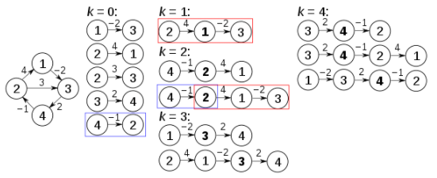

[TOC]
# 广度优先搜索
广度优先搜索可以用来求解**无权图的最短路径**问题。广度优先搜索每遍历到下一层则路径长度加一，遍历到终点时的路径长度即是问题的解。
[二进制矩阵中的最短路径](https://leetcode.cn/problems/shortest-path-in-binary-matrix/)
广度优先搜索如果需要按层次执行某些操作（比如查找最大的层、无权图的单源最短路径等问题），需要使用两层循环，外层循环判空，内存循环对当前层进行操作。下面的题目中bfs就是单源最短路径的模板题。
```java
class Solution {
    int[][] grid;
    int len;
    public int shortestPathBinaryMatrix(int[][] grid) {
        len = grid.length;
        if (grid[0][0] == 1 || grid[len-1][len-1] == 1) return -1;
        this.grid = grid;

        return bfs();
    }
    public int bfs() {
        Queue<int[]> queue = new ArrayDeque<>();
        queue.add(new int[]{0,0});
        grid[0][0] = 1;
        int[] disx = new int[]{-1, -1, -1, 0, 0, 1, 1, 1};
        int[] disy = new int[]{-1, 0, 1, -1, 1, -1, 0, 1};

        int ans = 1;
        while (!queue.isEmpty()) {
            int size = queue.size();
            while (--size >= 0) {
                int x = queue.peek()[0];
                int y = queue.poll()[1];
                if (x == len-1 && y == len-1) return ans;

                for (int i = 0; i < 8; i++) {
                    int nextx = disx[i] + x;
                    int nexty = disy[i] + y;
                    if (nextx >= len || nextx < 0 || nexty >= len || nexty < 0 || grid[nextx][nexty] == 1) continue;
                    queue.add(new int[]{nextx, nexty});
                    grid[nextx][nexty] = 1;
                }
            }
            ans++;
        }

        return -1;
    }
}
```

# 深度优先搜索
深度优先搜索是图中非常基础的算法，回溯法、和拓扑排序都可以通过深度优先搜索完成。
深度优先搜索还**可以判断图中是否存在环路**：记录各个节点的状态，0代表没有入栈，1代表正在栈中，2代表已出栈。如果遍历时碰到节点状态为1，则认为出现环路。
# 拓扑排序
拓扑排序的思路比较简单。也比较套路化。
**过程**：
1. 输出入度为0的节点，并将其后继节点入度减一；
2. 重复上述步骤，直到所有节点都已输出。

拓扑排序可以使用深度优先搜索进行求解。深度优先搜索按深度优先进行遍历，因此每次出栈一个元素时，它的所有后继都已出栈，因此**深度优先搜索的出栈顺序就是topo排序的逆序**。因此对图中所有入度为0的节点进行深度优先遍历，再按出栈顺序的逆序填充topo排序的数组即可。每出栈一个元素设置其状态为已访问即可。
如果图可能出现环路，则需要用深度优先搜索判断环路的方法来判断节点是否正在栈中，如果对某个节点入栈时发现这个节点已在栈中，则说明出现环路（同上）。
[课程顺序](https://leetcode-cn.com/problems/QA2IGt/)
```java
class Solution {
    int[] ans, state, inDegree;
    int pos;
    List<Integer>[] nextList;
    public int[] findOrder(int numCourses, int[][] prerequisites) {
        ans = new int[numCourses]; //按照出栈顺序倒序填充
        pos = numCourses;
        state = new int[numCourses]; //0代表未入栈，2代表已出栈，1代表未出栈
        inDegree = new int[numCourses]; //记录入度
        nextList = new List[numCourses]; //记录直接相邻的后继，用于深搜
        for (int i = 0; i < nextList.length; i++) {
            nextList[i] = new ArrayList<>();
        }
        for (int[] prerequisite : prerequisites) {
            int pre = prerequisite[1];
            int next = prerequisite[0];
            nextList[pre].add(next);
            inDegree[next]++;
        }

        for (int i = 0; i < numCourses; i++) { //对入度为0的点进行递归
            if (inDegree[i] == 0 && !dfs(i)) { //若返回false，则有环，直接返回
                return new int[0];
            }
        }
        return pos == 0 ? ans : new int[0];
    }
    public boolean dfs(int node) {
        state[node] = 1; //状态只可能为0
        for (int i : nextList[node]) { //遍历当前节点的所有后继，若状态为0则遍历，若状态为1则返回false
            if (state[i] == 0) dfs(i);
            else if (state[i] == 1) return false;
        }
        ans[--pos] = node;
        state[node] = 2;
        return true;
    }
}
```
# 并查集(Disjoint-set)
[维基百科并查集](https://zh.wikipedia.org/wiki/%E5%B9%B6%E6%9F%A5%E9%9B%86)
[并查集如何实现（通俗易懂）](https://leetcode-cn.com/problems/redundant-connection/solution/tong-su-jiang-jie-bing-cha-ji-bang-zhu-xiao-bai-ku/)
**不交集森林**：每一个集合看成一个树，每个集合中的元素看成树中的一个节点。每个节点保存该节点到它父节点的引用，树根保存一个空引用或到自身的引用（用于区分普通节点和树根）。
**集合的代表节点**：就是树的根节点，树中的每个节点都可以根据其保存的到父节点的引用，来找到根节点。
两个元素所在集合的代表节点不同，则认为是在不同的集合中。
并查集可以用hashmap进行存储，`(key,value)`分别代表`(自身节点，父节点)`。
**优化**：在查找某个节点`node`的根`root`时，将`node`直接挂在`root`下面，这样下一次再找`node`的根时就可一次找到
查找树根的时间复杂度：$O(h)$
[冗余连接](https://leetcode-cn.com/problems/redundant-connection/)
这题也可不用`HashMap`实现并查集，因为节点编号是从1到n，因此直接定义一个`father`数组来保存父节点即可
```java
class Solution {
    public int[] findRedundantConnection(int[][] edges) {
        HashMap<Integer, Integer> disjoint = new HashMap<>(); //存储并查集
        for (int i = 1; i <= edges.length; i++) {  //初始化，每一个点都是一个集合
            disjoint.put(i, i);
        }
        for (int[] edge : edges) {
            if (coRoot(disjoint, edge[0], edge[1])) return edge; //如果同根，则代表找到回路
        }
        return null;
    }
    public boolean coRoot(HashMap<Integer, Integer> disJoint, int node1, int node2) { // 判断node1与node2是否同根，不同根则进行合并
        int root1 = findRoot(disJoint, node1);
        int root2 = findRoot(disJoint, node2);
        if (root2 == root1) return true;
        disJoint.replace(root2, root1); //合并，将root2加到root1下面
        return false;
    }
    public int findRoot(HashMap<Integer, Integer> disJoint, int node) { //查找跟
        int root = disJoint.get(node);
        while (root != node) {
            node = root;
            root = disJoint.get(node);
        }
        return root;
    }
}
```
[2382. 删除操作后的最大子段和](https://leetcode.cn/problems/maximum-segment-sum-after-removals/)
代码来自[高赞题解](https://leetcode.cn/problems/maximum-segment-sum-after-removals/solution/by-endlesscheng-p61j/)
```java
class Solution {
    // 只有未删除的元素才能当做集合的根;
    // 初始时每个元素都是一个单独的集合。
    // 每删除一个元素（未被删除的元素都是一个集合的根），将当前集合与相邻的右边集合合并（因此fa需要多申请一个来保证每个元素删除时其右边都有一个集合）
    // 集合的值存放在根位置处（集合的值不包括根元素值）
    int[] root;

    public long[] maximumSegmentSum(int[] nums, int[] removeQueries) {
        int n = nums.length;
        root = new int[n + 1];
        for (int i = 0; i <= n; i++) root[i] = i;
        long[] sum = new long[n + 1];

        long[] ans = new long[n];
        for (int i = n - 1; i > 0; i--) {
            int removed = removeQueries[i];  // 被移除的根
            int to = find(removed + 1);  // 找到右边未被移除的集合的根
            root[removed] = to; // 将当前集合与右边集合合并
            sum[to] += sum[removed] + nums[removed];  // 集合的值 = 左边刚删除的集合的值 + 原来集合的值 + 当前元素的值
            ans[i - 1] = Math.max(ans[i], sum[to]);
        }
        return ans;
    }

    int find(int x) {
        if (root[x] != x) root[x] = find(root[x]);
        return root[x];
    }
}
```
# Dijkstra算法求单源最短路径
`dijkstra`算法用来寻找有向带权图的单源最短路径，边权值不可为负。无权图的单源最短路径可以用广度优先搜索实现。`dijkstra`求单源最短路径基于贪心算法实现。每轮迭代选择一个尚未确定最短路径的顶点，并判断用该顶点作为中间节点是否会缩短源点`v`到节点`i`的距离，如果会缩短，则更新`dist`数组。
**过程**：
1. 维护一个`dist`数组与`visited`数组，`dist`数组用于记录$v$到各顶点的距离。`visited`数组用于记录源点$v$到其它各节点的最小距离是否确定。初始时`visited[v]=true, dist[v]=0`。
2. 每一轮都挑选一个距离$v$最近且未确定的节点$k$并维护`visited`数组（初始时挑选$v$本身），然后用节点$k$更新`dist`数组，对于一个未确定的节点$i$，它的更新规则是`dist[i] = min(dist[i], dist[k] + graph[k][i])`，意思是，`v到k的距离 + k到i的距离 < v到i原先的距离 则更新`
3. 重复上述步骤，直到所有节点都确定下来了，则结束。

基于枚举实现的时间复杂度：$O(V^2)$
基于最小优先队列实现的时间复杂度：$O(E + VlogV)$
因此稠密图用枚举实现，稀疏图用最小优先队列实现。
[网络延迟时间](https://leetcode-cn.com/problems/network-delay-time/)
```java
class Solution {
    final int INF = 0x3f3f3f3f;
    public int networkDelayTime(int[][] times, int n, int k) {
        k--;
        int[][] graph = new int[n][n];
        for (int i = 0; i < n; i++) {
            Arrays.fill(graph[i], INF);
            graph[i][i] = 0;
        }
        for (int[] time : times) { //构建图
            graph[--time[0]][--time[1]] = time[2];
        }

        return dijkstra(graph, n, k);
    }
    public int dijkstra(int[][] graph, int n, int k) {
        int[] dis = new int[n]; //用来记录路径
        boolean[] visited = new boolean[n]; //记录是否在数组中
        Arrays.fill(dis, INF);
        dis[k] = 0;

        for (int i = 0; i < n; i++) {
            int minID = -1;
            for (int j = 0; j < n; j++) { //找一个没有确定，且距离k最小的点
                if (!visited[j] && (minID == -1 || dis[minID] > dis[j])) {
                    minID = j;
                }
            }
            if (minID == -1) break;
            visited[minID] = true;
            for (int j = 0; j < n; j++) {
                dis[j] = Math.min(dis[j], dis[minID] + graph[minID][j]);
            }
        }
        int ans = 0;
        for (int d : dis) {
            ans = Math.max(ans, d);
        }
        return ans == INF ? -1 : ans;
    }
}
```
# Bellman-Ford求单源最短路径
[数据结构（十一）：最短路径(Bellman-Ford算法)](https://www.jianshu.com/p/b876fe9b2338)详细介绍了算法的证明以及过程
`Bellman-Ford`算法可以处理元素为负数的情况，相对`Dijkstra`算法更通用。但是时间复杂度高于`Dijkstra`算法。此算法基于动态规划的思想。
`dist[k-1][i]`代表允许经过`k-1`条边的情况下，从`v`到`i`的最短距离。对于边`(from, to, weight)`，从源点`v`到达`to`有两种选择，①经过`k-1`条边从`v`到达`to`②经过`k-1`条边从`v`到达`from`，再经过`(from, to, weight)`这条边到达`to`。这两者取最小，就是考虑当前这条边下`dist[k][to]`的最优解。遍历完所有边之后的`dist[k]`数组，就是允许经过`k`条边情况下，从`v`到各点的最短距离。
`dist`的更新规则是：`dist[k][to] = min(min(dist[k][to], dist[k-1][to]), dist[k-1][from] + weight)`。而`dist[k]`只和`dist[k-1]`有关，因此可以进行空间优化。

另外可以证明，**若图中尚存在未确认顶点，则执行一次迭代后，会增加至少一个已确认顶点**。基于此，当某一轮未对`dist`进行更新，则认为任务已经完成，结束循环节省时间。最坏情况下是一次迭代增加一个已确认顶点，因此需要至少进行`n-1`次迭代。
时间复杂度：$O(VE)$
[网络延迟时间](https://leetcode-cn.com/problems/network-delay-time/)
```java
class Solution {
    final int INF = 0x3f3f3f3f;
    public int networkDelayTime(int[][] times, int n, int k) {
        int[] dist = new int[n + 1]; //0相当于孤立节点
        Arrays.fill(dist, INF); dist[k] = dist[0] = 0;

        boolean isChange = true;
        for (int i = 0; i < n - 1 && isChange; i++) {
            isChange = false;  //如此轮未更新，则任务完成
            for (int[] time : times) {
                if (dist[time[1]] > dist[time[0]] + time[2]) {
                    dist[time[1]] = dist[time[0]] + time[2];
                    isChange = true;
                }
            }
        }
        int ans = 0;
        for (int d : dist) {
            ans = Math.max(ans, d);
        }
        return ans == INF ? -1 : ans;
    }
}
```
# Floyd求全图最短路径
[floyd 算法维基百科](https://en.wikipedia.org/wiki/Floyd%E2%80%93Warshall_algorithm)
floyd算法用来寻找**有向带权图**的任意两点之间的最短路径，边权值可以为负，但是不可出现**负环**（即边权和为负的环，因为如果出现负环，则i到i的距离可以无限小），但是`floyd`算法可以用来检测是否存在负环（i到i的距离为负）。如果用来检测无向图，则权重不可为负。
**过程**：
1. 维护两个数组`D[i][j]`, `P[i][j]`，`D[i][j]`代表从`i`到`j`的最短距离，`P[i][j]`代表对应的最短路径。初始时用边填充`D`数组，如果`i`到`j`之间无边，则距离为`INF`；
2. 枚举节点`k`，代表节点`k`可以被当做中间节点使用，如果`k`当做中间节点比直接从`i`到`j`距离小，则更新`i`到`j`的最小距离以及对应路径。
3. 重复第二步，直到所有节点都枚举过了。

时间复杂度$O(V^3)$
空间复杂度$O(V^2)$

floyd算法有三层循环，应在最外层枚举节点$k$，代表k节点可作为中间节点加入$i$到$j$的路径中，当$D[i][j] > D[i][k] + D[k][j]$时，认为经过$k$节点比不经过$k$节点更优，此时更新$D[i][j] = D[i][k] + D[k][j]$。
**floyd算法用到了动态规划的思想**，$dp[k][i][j] = min(dp[k-1][i][j], dp[k-1][i][k] + dp[k-1][k][j])$，其中$dp[k][i][j]$代表当$k$可以作为从$i$到$j$的中间节点时，从$i$到$j$的最短路径。由于$dp[k]$只和$dp[k-1]$有关，因此可以进行空间优化。优化过后可以使用$D[i][j]$代表距离，$P[i][j]$代表路径。
```java
//floyd算法的核心步骤
let dist be a |V| × |V| array of minimum distances initialized to ∞ (infinity)
for each edge (u, v) do
    dist[u][v] ← w(u, v)  // The weight of the edge (u, v)
for each vertex v do
    dist[v][v] ← 0
for k from 1 to |V|
    for i from 1 to |V|
        for j from 1 to |V|
            if dist[i][j] > dist[i][k] + dist[k][j] 
                dist[i][j] ← dist[i][k] + dist[k][j]
            end if
```
[课程表 IV](https://leetcode-cn.com/problems/course-schedule-iv/)
这一题用floyd算法非常简单，而且数据量在100，$O(n^3)$也是可以过的。
```java
class Solution {
    boolean[][] isConn; //false代表不可达，true代表可达
    public List<Boolean> checkIfPrerequisite(int numCourses, int[][] prerequisites, int[][] queries) {
        isConn = new boolean[numCourses][numCourses];
        for (int[] prerequisite : prerequisites) {
            isConn[prerequisite[0]][prerequisite[1]] = true;
        }
        for (int k = 0; k < numCourses; k++) {
            for (int i = 0; i < numCourses; i++) {
                for (int j = 0; j < numCourses; j++) {
                    isConn[i][j] = isConn[i][k] && isConn[k][j] || isConn[i][j]; //ik可达且kj可达，或ij可达，则认为ij可达
                }
            }
        }
        List<Boolean> ans = new ArrayList<>();
        for (int[] query : queries) {
            ans.add(isConn[query[0]][query[1]]);
        }
        return ans;
    }
}
```
# Kruskal算法求最小生成树
kruskal算法使用了贪心思想，用并查集实现。
**步骤**：
1. 先对边按从小到大排序
2. 从小到大枚举边，若这个边的两个顶点所在集合不同，则合并两个集合，并将这个边加入到最小生成树中。

时间复杂度：$O(E\log E)$
[连接所有点的最小费用](https://leetcode-cn.com/problems/min-cost-to-connect-all-points/)
```java
class Solution {
    class Edge {
        int point1, point2, length;
        public Edge(int point1, int point2, int length) {
            this.point1 = point1;
            this.point2 = point2;
            this.length = length;
        }
    }
    public int minCostConnectPoints(int[][] points) {
        List<Edge> edges = new ArrayList<>();  //存放边
        int[] disjoint = new int[points.length]; //并查集，存放i的父节点
        for (int i = 0; i < points.length; i++) {
            disjoint[i] = i;
            for (int j = i + 1; j < points.length; j++) {
                int[] node1 = points[i];
                int[] node2 = points[j];
                edges.add(new Edge(i, j, Math.abs(node1[0] - node2[0]) + Math.abs(node1[1] - node2[1])));
            }
        }
        Collections.sort(edges, (o1, o2) -> {
            if (o1.length == o2.length) return 0;
            else return o1.length > o2.length ? 1 : -1;
        });
        return kruskal(edges, disjoint);
    }
    public int kruskal(List<Edge> edges, int[] disjoint) {
        int ans = 0;
        for (Edge edge : edges) {
            int root1 = findRoot(disjoint, edge.point1);
            int root2 = findRoot(disjoint, edge.point2);
            if (root1 != root2) {
                disjoint[root2] = root1; //将root2挂在root1后面
                ans += edge.length;
            }
        }
        return ans;
    }
    public int findRoot(int[] disjoint, int node) {
        int root = disjoint[node];
        while (disjoint[root] != root) {
            root = disjoint[root];
        }
        disjoint[node] = root; //维护树结构，降低树高度。加这一行执行时间369ms，不加513ms
        return root;
    }
}
```
# Prim
`prim`算法与`dijkstra`算法很像。不同的地方在于`dijkstra`算法的`dist`存储的是源点与其它节点的最短距离，而`prim`算法的`dist`存储的是各个节点与图的最短距离。
**过程**：
1. 每次在`dist`数组中选取一个未加入图中且距离图最近的一个节点将其加入图中，并更新其它节点与图的最近距离。
2. 重复上述步骤`n-1`次即可。

不使用堆的时间复杂度：$O(V^2)$
使用二叉最小堆：$O(V\log V+E\log V) = O(E\log V)$
使用斐波那契堆：$O(E+V\log V)$
[连接所有点的最小费用](https://leetcode-cn.com/problems/min-cost-to-connect-all-points/)
这一题中的图是稠密图（实际上是完全图），因此适合用`prim`算法求解，`prim`算法只需要`25ms`。
```java
class Solution {
    int n;
    final int INF = 0x3f3f3f3f;
    public int minCostConnectPoints(int[][] points) {
        n = points.length;
        int[][] graph = new int[n][n];
        for (int i = 0; i < n; i++) {
            for (int j = 0; j < i; j++) {
                graph[i][j] = graph[j][i];
            }
            graph[i][i] = 0;
            for (int j = i + 1; j < n; j++) {
                graph[i][j] = Math.abs(points[i][0] - points[j][0]) + Math.abs(points[i][1] - points[j][1]);
            }
        }
        return prim(graph);
    }
    public int prim(int[][] graph) {
        int[] dist = new int[n];  //存放i离图的距离，初始时将0加入图中
        boolean[] inGraph = new boolean[n];
        inGraph[0] = true;
        Arrays.fill(dist, INF);
        for (int i = 0; i < n; i++) {
            dist[i] = graph[0][i];
        }
        int ans = 0;
        for (int i = 0; i < n-1; i++) {
            //在dist中选一个最小的且没加入图中的节点
            int minID = -1;
            for (int j = 0; j < n; j++) {
                if (!inGraph[j] && (minID == -1 || dist[j] < dist[minID])) {
                    minID = j;
                }
            }
            ans += dist[minID];
            inGraph[minID] = true;
            //更新各个节点与图的最小距离
            for (int j = 0; j < n; j++) {
                dist[j] = Math.min(dist[j], graph[minID][j]);
            }
        }
        return ans;
    }
}
```
# 总结
* 深度优先搜索可以判断环路，只需要额外增加一个状态，来表示节点是否正在栈中。在所有节点入栈之前检查该节点是否在栈中，如果在栈中，则认为出现环路。
* 深度优先搜索的出栈顺序就是topo排序的逆序
* 并查集在查找节点的根节点时，同步更新它的父节点为根节点，以降低树高
* 求单源最小路径一般用`dijkstra`算法，如果有负元素，则需要用`Bellman-Ford`算法。
* `Kruskal`算法和`prim`算法都可用于求解图的最小生成树问题，稠密图适合使用`prim`算法，非稠密图可以用`kruskal`算法