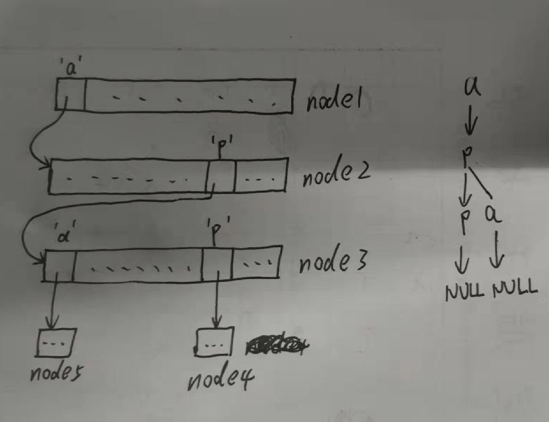

问题描述：给定一个字符串数组，判断这个数组中是否包含某一个字符串`word`，或判断这个数组是否包含前缀`prefix`。
暴力的实现方法是将给定的字符串`word`或`prefix`与字符串数组一一比对，查找到了则返回`true`，否则返回`false`。这种情况下的时间复杂度为$O(\lvert S \rvert n)$，空间复杂度$O(\lvert T \rvert)$。其中$\lvert S \rvert$代表给定字符串长度，$n$代表数组长度，$\lvert T \rvert$是字符串数组出现字符的总长度。

前缀树实现方式：时间复杂度为$O(\lvert S \rvert)$。空间复杂度$O(\lvert T \rvert \lvert \Sigma \rvert)$。其中$\lvert \Sigma \rvert$是字符集长度。
[实现 Trie (前缀树)](https://leetcode-cn.com/problems/implement-trie-prefix-tree/)
对于`Trie`树中的任意一个节点都包含一个长度为$\lvert \Sigma \rvert$的节点数组，和一个`isEnd`**代表当前节点是否是某个单词的末尾的下一个节点**。`Trie`树中的每个节点不一定只代表一个字符。`Trie`树中的每个节点都只有唯一一个父节点（根节点无父节点）

以下给出了Trie树构建的示例，一开始只有`node1`节点并且`node1`的所有位置都为`null`
1. 插入一个单词`app`：
①新建`node2`并将`node1`的`a`位置指向`node2`
②新建`node3`并将`node2`的`p`位置指向`node3`
③新建`node4`并将`node3`的`p`位置指向`node4`
④`node4`的`isEnd`为设为`true`。
2. 插入一个单词`apa`：
①新建`node5`并将`node3`的`a`位置指向`node5`
②`node5`的`isEnd`设为`true`。
3. 插入一个单词`appa`：
①新建`node6`并将`node4`的`a`位置指向`node6`
②`node6`的`isEnd`设为`true`。
4. 查找`apa`：
①`node1`的`a`位置指向`node2`
②`node2`的`p`位置指向`node3`
③`node3`的`a`位置指向`node5`
④`node5`的`isEnd`为`true`，代表存在这样的单词。

（下面图片展示了插入`app`和`apa`后的字典树）

```java
class Trie {
    private Trie[] tree;
    private boolean isEnd;
    public Trie() {
        tree = new Trie[26];
        isEnd = false;
    }

    public void insert(String word) {
        char[] chs = word.toCharArray();
        Trie pr = this;
        for (int i = 0; i < chs.length; i++) {
            int ch = chs[i] - 'a';
            if (pr.tree[ch] == null) {
                pr.tree[ch] = new Trie();
            }
            pr = pr.tree[ch];
        }
        pr.isEnd = true;
    }

    public boolean search(String word) {
        Trie pr = findTrie(word);
        return pr != null && pr.isEnd;
    }

    public boolean startsWith(String prefix) {
        return findTrie(prefix) != null;
    }
    public Trie findTrie(String word) {
        char[] chs = word.toCharArray();
        Trie pr = this;
        for (int i = 0; i < chs.length; i++) {
            int ch = chs[i] - 'a';
            if (pr.tree[ch] == null) return null;
            pr = pr.tree[ch];
        }
        return pr;
    }
}
```